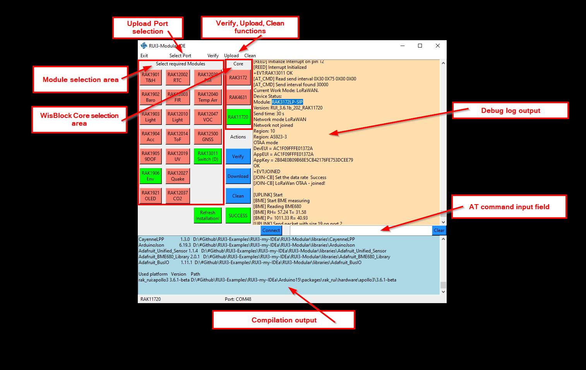

# WORK IN PROGRESS

# RUI3-Modular
This is an approach to create applications with RUI3 without writing code.    
It is as well trying to work without any installation effort.    
The simple IDE is written in Python and might require to install some additional modules.

## REMARK
This code is _**Work in progress**_ and far from finished. It is based on Python, but at the moment works only on Windows (Linux and MacOS needs testing).     
The repo is missing the required BSP's because the files are too large. The complete ZIP file including the BSP's can be downloaded from [Google Drive](https://drive.google.com/file/d/1urrvtsfqxffVnXEESbEryBydS33X3YlZ/view?usp=share_link).     

# Content
- [How does it work](#how-does-it-work)
   - [Step-by-step tutorial](#step-by-step-tutorial)
   - [Video](#video)
- [Hardware supported](#hardware-supported)
   - [_LIMITATIONS_](#limitations)
- [Packet data format](#packet-data-format)
- [Device setup](#device-setup)
   - [Custom AT commands](#custom-at-commands)

|  |  |  |    
| :-: | :-: | :-: |     

----

# How does it work

Instead of installing Arduino IDE, installing BSP's and libraries, the usage of RUI3-Modular is be limited to just downloading the compressed IDE, unzipping it on your computer, start a Python script and start creating an RUI3 based application for RAK3172, RAK4630 and RAK11720.    

## REMARK
For Windows an executable file is included in the compressed folder. rui3-my-idea.exe can be used only on Windows. It does not require to have Python installed.




This small IDE has ready to use files for many [WisBlock Modules](https://docs.rakwireless.com/Product-Categories/WisBlock/). No code parts need to be edited for a simple application using multiple of the available WisBlock Modules.    

Only a few steps are required to add a module to the application.     
The complete LoRaWAN communication is handled by RUI3, setup is done with WisToolBox or AT commands.     

## Step-by-step tutorial

This is a generic description for the six steps required to build an application. See below an example for two WisBlock modules.

1) Start the GUI either from a shell with _**`py ./rui3_modular.pyw`**_ or by double clicking on the _**`rui3_modular_full.exe`**_ executable file (Only Windows for now).     

> ## REMARK
> _**If the Python script doesn't start it might be that the Python library tkinter is missing. You can install the missing module with `post_install.bat` or `post_install.sh`.      
_**The .exe executable file is only for Windows**_    

2) Select a core module, either RAK3372, RAK4631 or RAK11722   

3) Prepare a WisBlock Base Board with the selected Core module and the WisBlock modules that are used in the application.    

4) Connect the WisBlock Base Board with the modules to the USB port of the computer

5) Select the modules used in the application with the buttons in the GUI    

> ## REMARK
> _** Some modules that are using GPIO's require to select the WisBlock Sensor Slot in which the modules are used**_

5) (Optional) Use the Verify function from the Menu to run a compilation test

6) Use the Upload function from the Menu to compile the code and upload it to the WisBlock Core module

7) After successful uploading the code, the Serial terminal is activated and shows the log output of the WisBlock Core module    

----

# Video 

https://user-images.githubusercontent.com/512690/209634072-ff93f893-ca29-490a-abc2-f228ae053b0e.mp4

----


# Hardware supported
| Module | Function | Supported |
| --     | --       | --          |
| [RAK4631-R](https://docs.rakwireless.com/Product-Categories/WisBlock/RAK4631-R/Overview/) ⤴️ | WisBlock Core module with RUI3| ✔ |
| [RAK3372](https://docs.rakwireless.com/Product-Categories/WisBlock/RAK3372/Overview/) ⤴️ | WisBlock Core module with RUI3| ✔ |
| [RAK19007](https://docs.rakwireless.com/Product-Categories/WisBlock/RAK19007/Overview/) ⤴️ | WisBlock Base board | ✔ |
| [RAK19003](https://docs.rakwireless.com/Product-Categories/WisBlock/RAK19003/Overview/) ⤴️ | WisBlock Mini Base board | ✔ |
| [RAK19001](https://docs.rakwireless.com/Product-Categories/WisBlock/RAK19001/Overview/) ⤴️ | WisBlock Fullsize Base board | ✔ |
| [RAK1901](https://docs.rakwireless.com/Product-Categories/WisBlock/RAK1901/Overview/) ⤴️ | WisBlock Temperature and Humidty Sensor | ✔ |
| [RAK1902](https://docs.rakwireless.com/Product-Categories/WisBlock/RAK1902/Overview/) ⤴️ | WisBlock Barometer Pressure Sensor | ✔ |
| [RAK1903](https://docs.rakwireless.com/Product-Categories/WisBlock/RAK1903/Overview/) ⤴️ | WisBlock Ambient Light Sensor | ✔ |
| [RAK1904](https://docs.rakwireless.com/Product-Categories/WisBlock/RAK1904/Overview/) ⤴️ | WisBlock Acceleration Sensor (used for GNSS solutions) | ✔ |
| [RAK1905](https://docs.rakwireless.com/Product-Categories/WisBlock/RAK1905/Overview/) ⤴️ | WisBlock 9 DOF sensor | ✔ |
| [RAK1906](https://docs.rakwireless.com/Product-Categories/WisBlock/RAK1906/Overview/) ⤴️ | WisBlock Environment Sensor | ✔ |
| [~~RAK1910~~](https://docs.rakwireless.com/Product-Categories/WisBlock/RAK1910/Overview/) ⤴️ | WisBlock GNSS Sensor | Work in progress |
| [RAK1921](https://docs.rakwireless.com/Product-Categories/WisBlock/RAK1921/Overview/) ⤴️ | WisBlock OLED display | ✔ |
| [RAK12002](https://docs.rakwireless.com/Product-Categories/WisBlock/RAK12002/Overview/) ⤴️ | WisBlock RTC module | ✔ |
| [RAK12003](https://docs.rakwireless.com/Product-Categories/WisBlock/RAK12003/Overview/) ⤴️ | WisBlock FIR sensor | ✔ |
| [~~RAK12004~~](https://docs.rakwireless.com/Product-Categories/WisBlock/RAK12004/Overview/) ⤴️ | WisBlock MQ2 Gas sensor | Work in progress |
| [~~RAK12008~~](https://docs.rakwireless.com/Product-Categories/WisBlock/RAK12008/Overview/) ⤴️ | WisBlock MG812 CO2 Gas sensor | Work in progress |
| [~~RAK12009~~](https://docs.rakwireless.com/Product-Categories/WisBlock/RAK12009/Overview/) ⤴️ | WisBlock MQ3 Alcohol Gas sensor | Work in progress |
| [RAK12010](https://docs.rakwireless.com/Product-Categories/WisBlock/RAK12010/Overview/) ⤴️ | WisBlock Ambient Light sensor | ✔ |
| [RAK12014](https://docs.rakwireless.com/Product-Categories/WisBlock/RAK12014/Overview/) ⤴️ | WisBlock Laser ToF sensor | ✔ |
| [RAK12019](https://docs.rakwireless.com/Product-Categories/WisBlock/RAK12019/Overview/) ⤴️ | WisBlock UV Light sensor | ✔ |
| [~~RAK12025~~](https://docs.rakwireless.com/Product-Categories/WisBlock/RAK12025/Overview/) ⤴️ | WisBlock Gyroscope sensor | Work in progress |
| [RAK12027](https://docs.rakwireless.com/Product-Categories/WisBlock/RAK12027/Overview/) ⤴️ | WisBlock Seismic sensor | ✔ |
| [~~RAK12023/RAK12035~~](https://docs.rakwireless.com/Product-Categories/WisBlock/RAK12023/Overview/) ⤴️ | WisBlock Soil Moisture and Temperature sensor | Work in progress |
| [RAK12037](https://docs.rakwireless.com/Product-Categories/WisBlock/RAK12037/Overview/) ⤴️ | WisBlock CO2 sensor | ✔ |
| [RAK12039](https://docs.rakwireless.com/Product-Categories/WisBlock/RAK12039/Overview/) ⤴️ | WisBlock PM sensor | ✔ |
| [RAK12040](https://docs.rakwireless.com/Product-Categories/WisBlock/RAK12040/Overview/) ⤴️ | WisBlock AMG8833 temperature array sensor | ✔ |
| [RAK12047](https://docs.rakwireless.com/Product-Categories/WisBlock/RAK12047/Overview/) ⤴️ | WisBlock VOC sensor | ✔ |
| [RAK12500](https://docs.rakwireless.com/Product-Categories/WisBlock/RAK12500/Overview/) ⤴️ | WisBlock GNSS Sensor | ✔ |
| [RAK13011](https://docs.rakwireless.com/Product-Categories/WisBlock/RAK13011/Overview/) ⤴️ | WisBlock Reed Relay Switch | ✔ |
| [~~RAK14002~~](https://docs.rakwireless.com/Product-Categories/WisBlock/RAK14002/Overview/) ⤴️ | WisBlock 3 button touch pad | Work in progress |
| [~~RAK14003~~](https://docs.rakwireless.com/Product-Categories/WisBlock/RAK14003/Overview/) ⤴️ | WisBlock LED bar display | Work in progress |
| [~~RAK14008~~](https://docs.rakwireless.com/Product-Categories/WisBlock/RAK14008/Overview/) ⤴️ | WisBlock Gesture sensor | Work in progress |


----

# Software used

No need to install any of this, the Arduino CLI, the needed BSP's and libraries are already in the ZIP file!     
This list is just an overview what is used.
## IDE
- [Python GUI + tkinter](https://www.python.org/downloads/) ⤴️
- [Arduino CLI](https://arduino.github.io/arduino-cli/0.29/) ⤴️
- [RAK-STM32-RUI](https://github.com/RAKWireless/RAKwireless-Arduino-BSP-Index) ⤴️
- [RAK-nRF52-RUI](https://github.com/RAKWireless/RAKwireless-Arduino-BSP-Index) ⤴️
- [RAK-APOLLO3-RUI](https://github.com/RAKWireless/RAK-APOLLO3-RUI) ⤴️
## LoRaWAN payload creation
- [CayenneLPP](https://github.com/ElectronicCats/CayenneLPP) ⤴️
- [ArduinoJson](https://registry.platformio.org/libraries/bblanchon/ArduinoJson) ⤴️
## Sensor libraries
- [RAKwireless RAK1901 Temperature and Humidity SHTC3](https://downloads.rakwireless.com/RUI/RUI3/Library/RAKwireless_RAK1901_Temperature_and_Humidity_SHTC3.zip) (manual from ZIP) ⤴️
- [Adafruit LPS2X](https://github.com/adafruit/Adafruit_LPS2X) ⤴️
- [ClosedCube OPT3001](https://github.com/beegee-tokyo/ClosedCube_OPT3001_Arduino) ⤴️
- [Sparkfun LIS3DH](https://github.com/sparkfun/SparkFun_LIS3DH_Arduino_Library) ⤴️
- [MPU9250](https://github.com/wollewald/MPU9250_WE) ⤴️
- [Adafruit BME680 Library](https://github.com/adafruit/Adafruit_BME680) ⤴️
- [nRF52_OLED](https://github.com/beegee-tokyo/nRF52_OLED) ⤴️
- [Melopero RV3028](https://github.com/melopero/Melopero_RV-3028_Arduino_Library) ⤴️
- [SparkFun MLX90632 Noncontact Infrared Temperature Sensor](https://github.com/sparkfun/SparkFun_MLX90632_Arduino_Library) ⤴️
- [RAKwireless VEML Light Sensor](https://github.com/RAKWireless/RAK12010-VEML7700-Library) ⤴️
- [Pololu VL53L0X](https://github.com/pololu/vl53l0x-arduino) ⤴️
- [RAK12019_LTR390_UV_Light](https://github.com/RAKWireless/RAK12019_LTR390) ⤴️
- [RAK12027-D7S](https://github.com/RAKWireless/RAK12027-D7S) ⤴️
- [SparkFun SCD30 Arduino Library](https://github.com/sparkfun/SparkFun_SCD30_Arduino_Library) ⤴️
- [RAK12039-PMSA003I](https://github.com/RAKWireless/RAK12039-PMSA003I) ⤴️
- [Melopero AMG8833](https://github.com/melopero/Melopero_AMG8833) ⤴️
- [Sensirion Core](https://github.com/Sensirion/arduino-core) ⤴️
- [Sensirion Gas Index Algorithm](https://github.com/Sensirion/gas-index-algorithm) ⤴️
- [Sensirion I2C SGP40](https://github.com/Sensirion/arduino-i2c-sgp40) ⤴️
- [SparkFun u-blox GNSS Arduino Library](https://github.com/sparkfun/SparkFun_u-blox_GNSS_Arduino_Library) ⤴️

----

# Packet data format
The packet data is made compatible with the extended Cayenne LPP encoding from [ElectronicCats/CayenneLPP](https://github.com/ElectronicCats/CayenneLPP) ⤴️.    
The content of the packet depends on the modules installed on the WisBlock Base Board:     

| Data                      | Channel # | Channel ID | Length   | Comment                                           | Required Module   | Decoded Field Name |
| --                        | --        | --         | --       | --                                                | --                | --                 |
| Battery value             | 1         | _**116**_  | 2 bytes  | 0.01 V Unsigned MSB                               | RAK4631           | voltage_1          |
| Humidity                  | 2         | 104        | 1 bytes  | in %RH                                            | RAK1901           | humidity_2         |
| Temperature               | 3         | 103        | 2 bytes  | in °C                                             | RAK1901           | temperature_3      | 
| Barometric Pressure       | 4         | 115        | 2 bytes  | in hPa (mBar)                                     | RAK1902           | barometer_4        |
| Illuminance               | 5         | 101        | 2 bytes  | 1 lux unsigned                                    | RAK1903           | illuminance_5      |
| Humidity 2                | 6         | 104        | 1 bytes  | in %RH                                            | RAK1906           | humidity_6         |
| Temperature 2             | 7         | 103        | 2 bytes  | in °C                                             | RAK1906           | temperature_7      | 
| Barometric Pressure 2     | 8         | 115        | 2 bytes  | in hPa (mBar)                                     | RAK1906           | barometer_8        |
| Gas Resistance 2          | 9         | 2          | 2 bytes  | 0.01 signed (kOhm)                                | RAK1906           | analog_9           |
| GNSS stand. resolution    | 10        | 136        | 9 bytes  | 3 byte lon/lat 0.0001 °, 3 bytes alt 0.01 meter   | RAK12500          | gps_10             |
| GNSS enhanced resolution  | 10        | _**137**_  | 11 bytes | 4 byte lon/lat 0.000001 °, 3 bytes alt 0.01 meter | RAK12500          | gps_10             |
| Soil Temperature          | 11        | 103        | 2 bytes  | in °C                                             | RAK12023/RAK12035 | temperature_11     |
| Soil Humidity             | 12        | 104        | 1 bytes  | in %RH                                            | RAK12023/RAK12035 | humidity_12        |
| Soil Humidity Raw         | 13        | 2          | 2 bytes  | 0.01 signed                                       | RAK12023/RAK12035 | analog_in_13       |
| Soil Data Valid           | 14        | 102        | 1 bytes  | bool                                              | RAK12023/RAK12035 | presence_14        |
| Illuminance 2             | 15        | 101        | 2 bytes  | 1 lux unsigned                                    | RAK12010          | illuminance_15     |
| VOC                       | 16        | _**138**_  | 2 bytes  | VOC index                                         | RAK12047          | voc_16             |
| MQ2 Gas                   | 17        | 2          | 2 bytes  | 0.01 signed                                       | RAK12004          | analog_in_17       |
| MQ2 Gas Percentage        | 18        | _**120**_  | 1 bytes  | 1-100% unsigned                                   | RAK12004          | percentage_18      |
| MG812 Gas                 | 19        | 2          | 2 bytes  | 0.01 signed                                       | RAK12008          | analog_in_19       |
| MG812 Gas Percentage      | 20        | _**120**_  | 1 bytes  | 1-100% unsigned                                   | RAK12008          | percentage_20      |
| MQ3 Alcohol Gas           | 21        | 2          | 2 bytes  | 0.01 signed                                       | RAK12009          | analog_in_21       |
| MQ3 Alcohol Gas Perc.     | 22        | _**120**_  | 1 bytes  | 1-100% unsigned                                   | RAK12009          | percentage_22      |
| ToF distance              | 23        | 2          | 2 bytes  | 0.01 signed                                       | RAK12014          | analog_in_23       |
| ToF Data Valid            | 24        | 102        | 1 bytes  | bool                                              | RAK12014          | presence_24        |
| Gyro triggered            | 25        | _**134**_  | 6 bytes  | 2 bytes per axis, 0.01 °/s                        | RAK12025          | gyrometer_25       |
| Gesture detected          | 26        | 0          | 1 byte   | 1 byte with id of gesture                         | RAK14008          | digital_in_26      |
| LTR390 UVI value          | 27        | 2          | 2 byte   | 0.01 signed                                       | RAK12019          | analog_in_27       | 
| LTR390 UVS value          | 28        | 101        | 2 bytes  | 1 lux unsigned                                    | RAK12019          | illuminance_28     | 
| INA219 Current            | 29        | 2          | 2 byte   | 0.01 signed                                       | RAK16000          | analog_29          | 
| INA219 Voltage            | 30        | 2          | 2 byte   | 0.01 signed                                       | RAK16000          | analog_30          | 
| INA219 Power              | 31        | 2          | 2 byte   | 0.01 signed                                       | RAK16000          | analog_31          | 
| Touchpad left             | 32        | 102        | 1 bytes  | bool                                              | RAK14002          | presence_32        | 
| Touchpad middle           | 33        | 102        | 1 bytes  | bool                                              | RAK14002          | presence_33        | 
| Touchpad right            | 34        | 102        | 1 bytes  | bool                                              | RAK14002          | presence_34        | 
| SCD30 CO2 concentration   | 35        | 125        | 2 bytes  | 1 ppm unsigned                                    | RAK12037          | concentration_35   |
| SCD30 temperature         | 36        | 103        | 2 bytes  | in °C                                             | RAK12037          | temperature_36     |
| SCD30 humidity            | 37        | 104        | 1 byte   | in %RH                                            | RAK12037          | humidity_37        |
| MLX90632 sensor temp      | 38        | 103        | 2 bytes  | in °C                                             | RAK12003          | temperature_38     |
| MLX90632 object temp      | 39        | 103        | 2 bytes  | in °C                                             | RAK12003          | temperature_39     |
| PM 1.0 value              | 40        | 103        | 2 bytes  | in ug/m3                                          | RAK12003          | voc_40             |
| PM 2.5 value              | 41        | 103        | 2 bytes  | in ug/m3                                          | RAK12003          | voc_41             |
| PM 10 value               | 42        | 103        | 2 bytes  | in ug/m3                                          | RAK12003          | voc_42             |
| Earthquake event          | 43        | 102        | 1 byte   | bool                                              | RAK12027          | presence_43        |
| Earthquake SI value       | 44        | 2          | 2 bytes  | analog 10 * m/s                                   | RAK12027          | analog_44          |
| Earthquake PGA value      | 45        | 2          | 2 bytes  | analog 10 * m/s2                                  | RAK12027          | analog_45          |
| Earthquake SHUTOFF alert  | 46        | 102        | 1 byte   | bool                                              | RAK12027          | presence_46        |
| Earthquake collapse alert | 47        | 102        | 1 byte   | bool                                              | RAK12027          | presence_47        |

### _REMARK_
Channel ID's in cursive are extended format and not supported by standard Cayenne LPP data decoders.

Example decoders for TTN, Chirpstack, Helium and Datacake can be found in the folder [decoders](./decoders) ⤴️

### _REMARK_
This list is constantly extended as we add new WisBlock modules. Check out the [RAKwireless Standardized Payload](https://github.com/RAKWireless/RAKwireless_Standardized_Payload) repo for the latest status.

# Device setup

The setup of the device (LoRaWAN region, DevEUI, AppEUI, AppKey, ....) can be done with AT commands over the USB port or with [WisToolBox](https://docs.rakwireless.com/Product-Categories/Software-Tools/WisToolBox/Overview/)

**Example AT commands:**
```AT
AT+NWM=1
AT+NJM=1
AT+BAND=10
AT+DEVEUI=1000000000000001
AT+APPEUI=AB00AB00AB00AB00
AT+APPKEY=AB00AB00AB00AB00AB00AB00AB00AB00
ATC+SENDINT=600
```

| Command | Explanation | 
| --- | --- | 
| AT+NWM=1 | set the node into LoRaWAN mode |
| AT+NJM=1 | set network join method to OTAA |
| AT+BAND=10 | set LPWAN region (here AS923-3) see [AT Command Manual](https://docs.rakwireless.com/RUI3/Serial-Operating-Modes/AT-Command-Manual/#at-band) ⤴️ for all regions |
| AT+DEVEUI=1000000000000001 | set the device EUI, best to use the DevEUI that is printed on the label of your WisBlock Core module |
| AT+APPEUI=AB00AB00AB00AB00 | set the application EUI, required on the LoRaWAN server |
| | AT+APPKEY=AB00AB00AB00AB00AB00AB00AB00AB00 | set the application Key, used to encrypt the data packet during network join |
ATC+SENDINT=600 | set the interval the sensor node will send data packets. 600 == 10 x 60 seconds == 10minutes |

### _REMARK_
The manual for all AT commands can be found here: [AT-Command Manual](https://docs.rakwireless.com/RUI3/Serial-Operating-Modes/AT-Command-Manual/) ⤴️

## Custom AT commands
There are additional custom AT commands implemented:

**`ATC+STATUS`** to get the current status of the device.

Example:
```log
atc+status=?

Device Status:
Module: RAK4630
Version: RUI_3.5.2b_175_RAK4631
Send time: 120 s
Network mode LoRaWAN
Network joined
Region: 10
Region: AS923-3
OTAA mode
DevEUI = AC1F09FFFE057110
AppEUI = AC1F09FFFE057110
AppKey = 2B84E0B09B68E5CB42176FE753DCEE79
+EVT:RAK1901 OK
+EVT:RAK1902 OK
+EVT:RAK1903 OK
+EVT:RAK12019 OK
OK
```

**`ATC+SENDINT`** to get and set the automatic send interval

Example:
```log
atc+sendfreq=?

ATC+SENDINT=120s
OK

atc+sendfreq=120
OK
```

If an RAK12002 RTC module is used, the command **`ATC+RTC`** is available to get and set the date time

Example:
```log
atc+rtc=?

ATC+RTC=2000.01.01 0:00:21

atc+rtc=2022:10:21:14:15
OK

atc+rtc=?

ATC+RTC=2022.10.21 14:15:25
```

If an RAK12500 GNSS module is used, the command **`ATC+GNSS`** is available to change GNSS precision and payload format.
It accepts 4 different values:
0 = 4digit prec., 1 = 6digit prec, 2 = Helium Mapper format, 3 = Field Tester format

Example:
```log
atc+gnss=?

GNSS 4 digit Cayenne LPP

atc+gnss=1
OK

```log
atc+gnss=?

GNSS 6 digit extended Cayenne LPP
```

----

